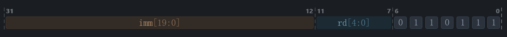
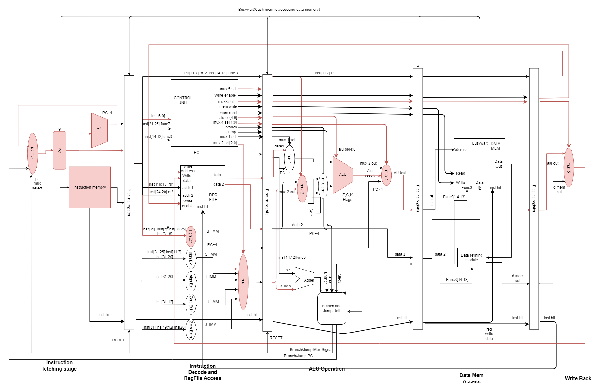
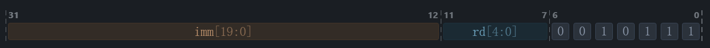
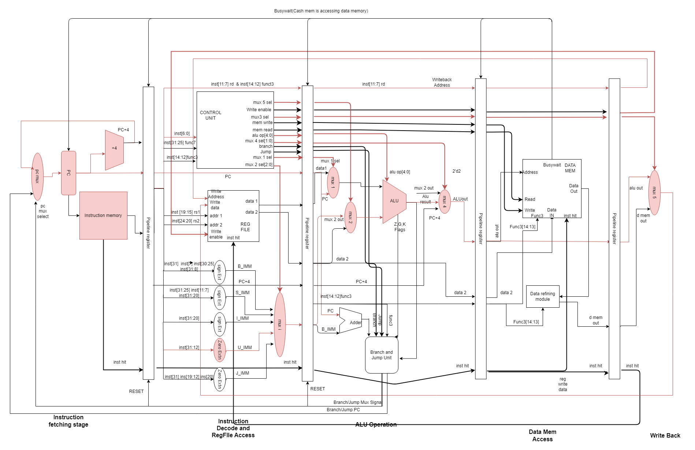
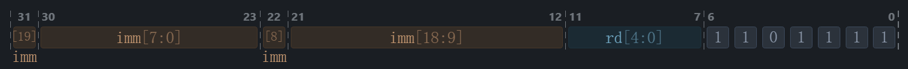
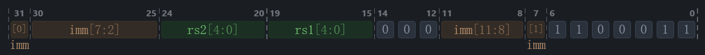
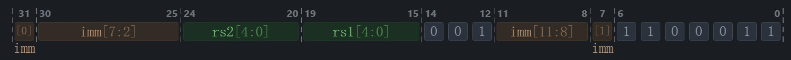
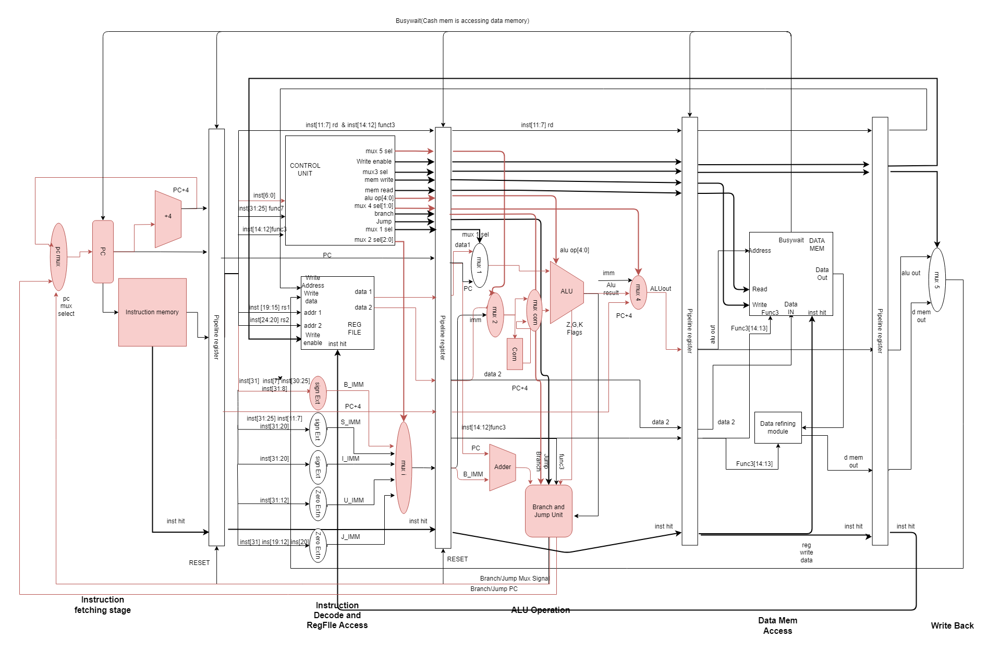

# Instruction testing

## Instructions

1. **LUI**

    - Instruction format

        

    - Instruction State Transer Model

            rd <- imm << 12
    - Type: 
            
            U - Type
    - Format

            LUI RD, IMM
    - Example

        ```
        LUI x0, 500
        ```
        ```
        00000000000111110100 00000 0110111
        ```
        ```
        0x001f4037
        ```
    - Datapath

        

    - GTK wave form results

        [Wave File](gtk_files/LUI.vcd)

1. **AUIPC** 

    - Instruction format

        

    - Instruction State Transer Model

            rd <- pc + imm << 12
    - Type: 
            
            U - Type
    - Format

            AUIPC RD, IMM
    - Example

        ```
        AUIPC x0, 500
        ```
        ```
        00000000000111110100 00000 0010111
        ```
        ```
        0x001f4017
        ```
    - Datapath

        

    - GTK wave form results

        [Wave File](gtk_files/LUI.vcd)

1. **JAL** 

    - Instruction format

        

    - Instruction State Transer Model

            rd <- pc + 4
            pc <- pc + imm
    - Type: 
            
            J - Type
    - Format

            JAL RD, OFFSET
    - Example

        ```
        JAL x2, 8
        ```
        ```
        0 0000001000 0 00000000 00010 1101111
        ```
        ```
        0x0000006f
        ```
    - Datapath

        

    - GTK wave form results

        [Wave File](gtk_files/LUI.vcd)

1. **BEQ, BNE, BLT, BGE, BLTU, BGEU** 

    - Instruction format

        

        

    - Instruction State Transer Model

            pc <- rs1 == rs2 ? pc + imm, pc + 4

            pc <- rs1 != rs2 ? pc + imm, pc + 4
    - Type: 
            
            B - Type
    - Format
        ```
        BEQ RS1, RS2, IMM
        ```
        ```
        BNE RS1, RS2, IMM
        ```
    - Example

        ```
        BEQ x0, x1, 16

        00000001000 0 00000000 00010 1101111

        0x00100863
        ```
        ```
        BNE x0, x1, 4

        0000000 00001 00000 000 10000 1100011

        0000006f
        ```
    - Datapath

        

    - GTK wave form results

        [Wave File](gtk_files/)
