# Instruction testing

## Instructions

1.  **LUI**

    - Instruction format

      

    - Instruction State Transer Model

            rd <- imm << 12

    - Type:
      U - Type
    - Format

            LUI RD, IMM

    - Example

      ```
      LUI x0, 500
      ```

      ```
      00000000000111110100 00000 0110111
      ```

      ```
      0x001f4037
      ```

    - Datapath

      

    - GTK wave form results

      [Wave File](gtk_files/LUI.vcd)

1.  **AUIPC**

    - Instruction format

      

    - Instruction State Transer Model

            rd <- pc + imm << 12

    - Type:
      U - Type
    - Format

            AUIPC RD, IMM

    - Example

      ```
      AUIPC x0, 500
      ```

      ```
      00000000000111110100 00000 0010111
      ```

      ```
      0x001f4017
      ```

    - Datapath

      

    - GTK wave form results

      [Wave File](gtk_files/LUI.vcd)

1.  **JAL**

    - Instruction format

      

    - Instruction State Transer Model

            rd <- pc + 4
            pc <- pc + imm

    - Type:
      J - Type
    - Format

            JAL RD, OFFSET

    - Example

      ```
      JAL x2, 8
      ```

      ```
      0 0000001000 0 00000000 00010 1101111
      ```

      ```
      0x0000006f
      ```

    - Datapath

      

    - GTK wave form results

      [Wave File](gtk_files/LUI.vcd)

1.  **BEQ, BNE, BLT, BGE, BLTU, BGEU**

    - Instruction format

      

      

    - Instruction State Transer Model

            pc <- rs1 == rs2 ? pc + imm, pc + 4

            pc <- rs1 != rs2 ? pc + imm, pc + 4

    - Type:
      B - Type
    - Format
      ```
      BEQ RS1, RS2, IMM
      ```
      ```
      BNE RS1, RS2, IMM
      ```
    - Example

      ```
      BEQ x0, x1, 16

      00000001000 0 00000000 00010 1101111

      0x00100863
      ```

      ```
      BNE x0, x1, 4

      0000000 00001 00000 000 10000 1100011

      0000006f
      ```

    - Datapath

      

    - GTK wave form results

      [Wave File](gtk_files/)

1.  **LB, LW, LH**

    - Instruction format

      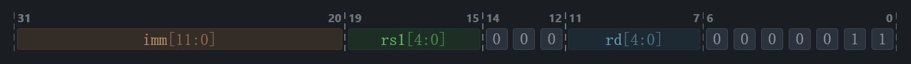

      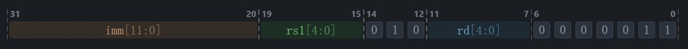

      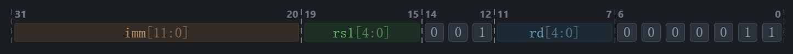

    - Instruction State Transer Model

            rd <- $(rs1 + imm)

            rd <- $(rs1 + imm) & 0xFFFF

            rd <- s16'$(rs1 + imm)

    - Type: I - Type
    - Format
      ```
      LB RD, OFFSET(RS1)
      ```
      ```
      LW RD, OFFSET(RS1)
      ```
      ```
      LH RD, OFFSET(RS1)
      ```
    - Example

      ```
      LB x1, 5(x0)

      000000000101 00000 000 00001 0000011

      0x00500083
      ```

      ```
      LW x1, 5(x0)

      000000000101 00000 010 00001 0000011

      0x00502083
      ```

      ```
      LH x1, 5(x0)

      000000000101 00000 001 00001 0000011

      0x00501083
      ```

    - Datapath

      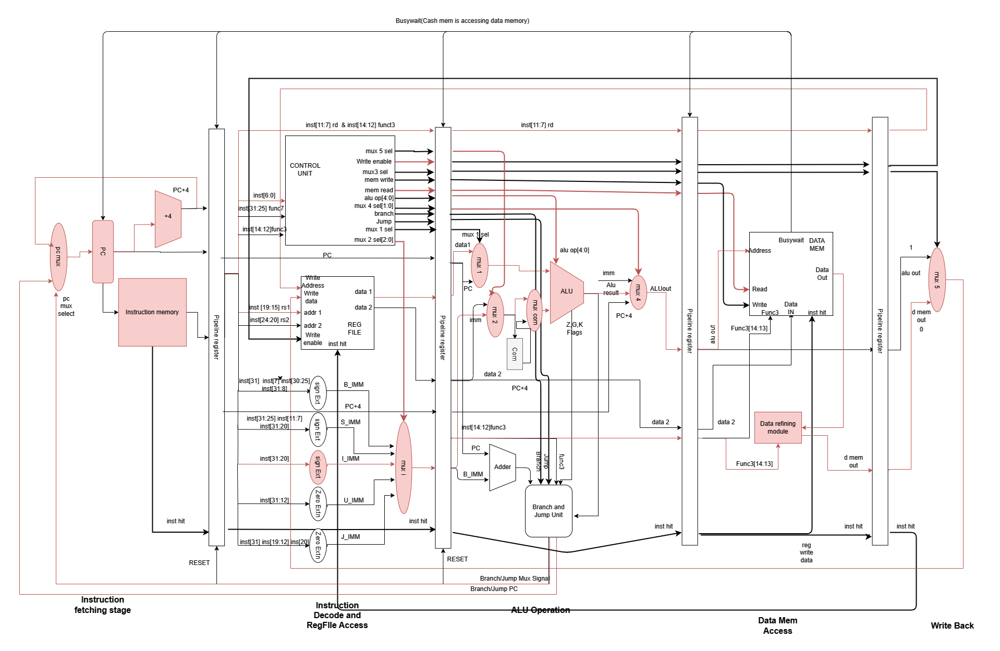

    - GTK wave form results

      [Wave File](gtk_files/)

1.  **SB, SW**

    - Instruction format

      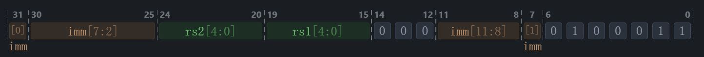

      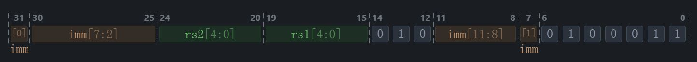

    - Instruction State Transer Model

            rs2 <- rs1 + imm

            rs2 <- (rs1 + imm) & 0xFFFF

    - Type: S - Type
    - Format
      ```
      SB RS2, OFFSET(RS1)
      ```
      ```
      SW RS2, OFFSET(RS1)
      ```
    - Example

      ```
      SB x1, 5(x0)

      0000000 00001 00000 000 00101 0100011

      0x001002a3
      ```

      ```
      SW x1, 5(x0)

      0000000 00001 00000 010 00101 0100011

      0x001022a3
      ```

    - Datapath

      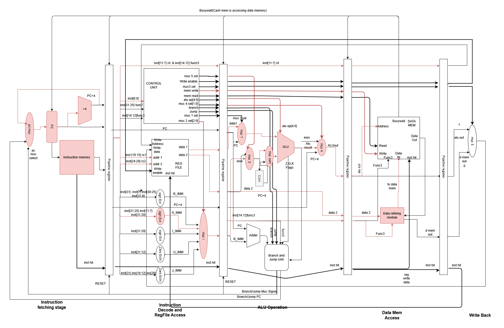

    - GTK wave form results

      [Wave File](gtk_files/)

1.  **ADDI, SLTI, ANDI**

    - Instruction format

      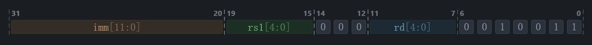

      

      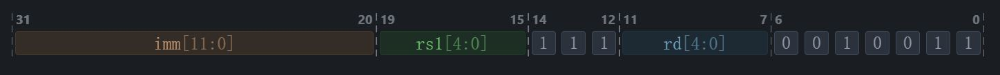

    - Instruction State Transer Model

            rd <- rs1 + imm

            rd <- s'rs1 < imm

            rd <- rs1 & imm

    - Type: I - Type
    - Format
      ```
      ADDI RD, RS1, IMM
      ```
      ```
      SLTI RD, RS1, IMM
      ```
      ```
      ANDI RD, RS1, IMM
      ```
    - Example

      ```
      addi x3, x0, 1000

      001111101000 00000 000 00011 0010011

      0x3e800193
      ```

      ```
      slti x3, x0, 1000

      001111101000 00000 010 00011 0010011

      0x3e802193
      ```

      ```
      andi x3, x0, 1000

      001111101000 00000 111 00011 0010011

      0x3e807193
      ```

    - Datapath

      

    - GTK wave form results

      [Wave File](gtk_files/)

1.  **ADD, SUB, AND**

    - Instruction format

      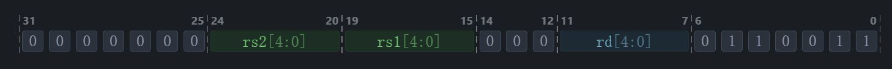

      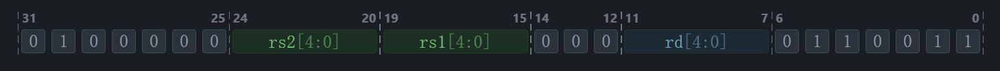

      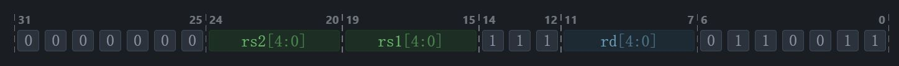

    - Instruction State Transer Model

            rd <- rs1 + rs2

            rd <- rs1 - rs2

            rd <- rs1 & rs2

    - Type: R - Type
    - Format
      ```
      ADD RD, RS1, RS2
      ```
      ```
      SUB RD, RS1, RS2
      ```
      ```
      AND RD, RS1, RS2
      ```
    - Example

      ```
      add x0, x1, x2

      0000000 00010 00001 000 00000 0110011

      0x00208033
      ```

      ```
      sub x0, x1, x2

      0100000 00010 00001 000 00000 0110011

      0x40208033
      ```

      ```
      and x0, x1, x2

      0000000 00010 00001 111 00000 0110011

      0x0020f033
      ```

    - Datapath

      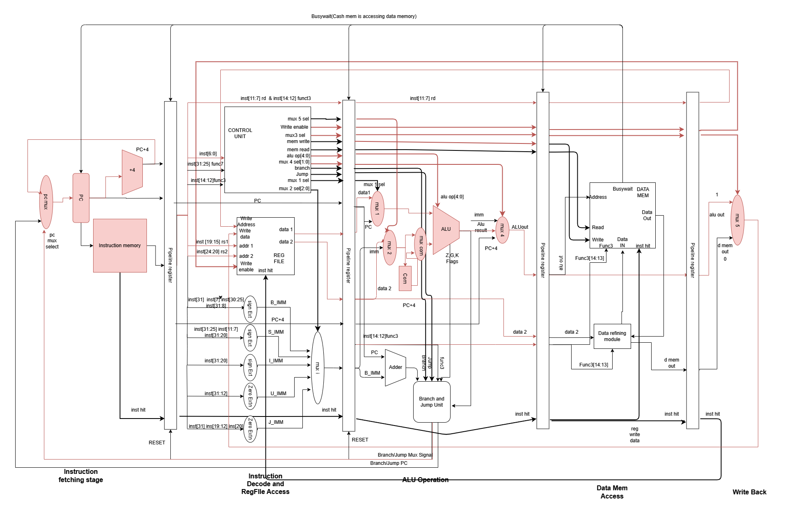

    - GTK wave form results

      [Wave File](gtk_files/)
