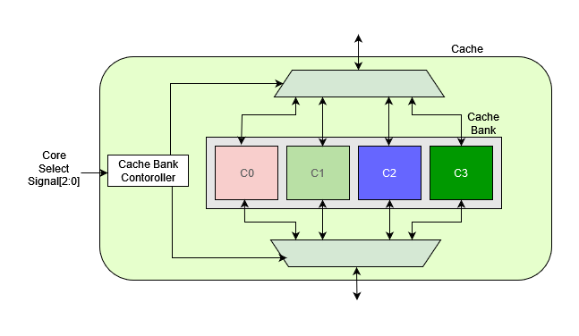
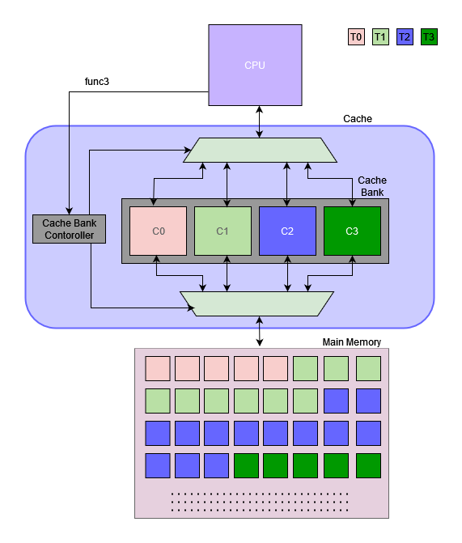
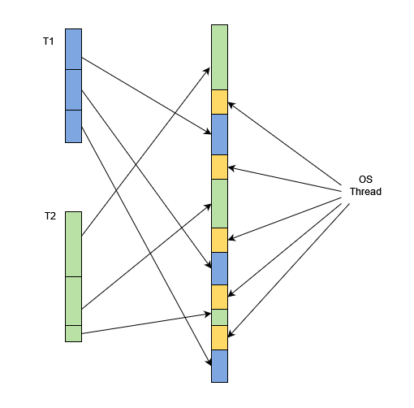
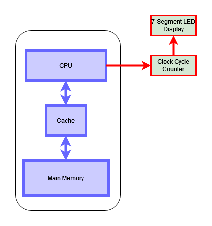
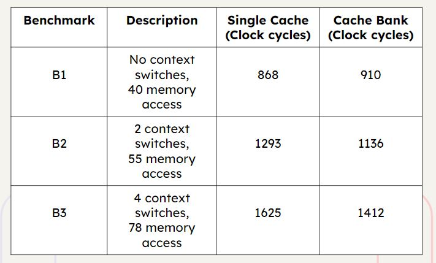

[comment]: # "This is the standard layout for the project, but you can clean this and use your own template"

# OS-Initiated Cache Switching to Minimize Performance Loss in Context Switches

#### Team

- e17015, M.R.M. Arshad, [email](mailto:e17015@eng.pdn.ac.lk)
- e17090, F.B.A. Harshamal, [email](mailto:e17090@eng.pdn.ac.lk)
- e17168, K.H.S.P. Kodagoda , [email](mailto:e17168@eng.pdn.ac.lk)

#### Supervisors

- Dr.Isuru Nawinne, [email](mailto:name@eng.pdn.ac.lk)
- Prof.Roshan Ragel, [email](mailto:name@eng.pdn.ac.lk)
- Dr.Mahanama Wickramasingh, [email](mailto:name@eng.pdn.ac.lk)
- Dr.Haris Javaid, [email](mailto:name@eng.pdn.ac.lk)

#### Table of content

1. [Abstract](#abstract)
2. [Related works](#related-works)
3. [Methodology](#methodology)
4. [Experiment Setup and Implementation](#experiment-setup-and-implementation)
5. [Results and Analysis](#results-and-analysis)
6. [Conclusion](#conclusion)
7. [Publications](#publications)
8. [Links](#links)

---

## Abstract

Usually, accessing the main memory consumes a considerable amount of time. Therefore, the cache is placed between the main memory and the CPU to reduce memory access latency. Caches primarily rely on spatial and temporal locality to enhance data access speed.

Context switching is a method to share CPU time among multiple threads effectively. Context switching may result in invalidating cached content because, when a new thread is loaded, it may not have the same working set as the previous context. Therefore, the CPU has to access the main memory and load the relevant data block into the cache. This process places a considerable burden on the CPU, reducing its performance.

As a solution, it is important to introduce a design that minimizes cache misses during context-switching.
In this project, we aim to introduce a cache bank instead of a single cache system to a RISC-V pipelined processor and measure the impact on the system performance compared to the single cache system. 

## Related works

Patel et al. Patel et al. introduce an innovative indexing system for direct-mapped caching. This approach reduces conflicts by using program-specific data. Researchers design a reconfigurable bit selector to optimize cache indexing during runtime.
Albanese and colleagues have made significant contributions to the switchable cache field. The highly reconfigurable architecture of the cache is presented. It allows dynamic modification of caching methods through hardware configuration registers. This flexibility is provided by the ability to adjust the number of cache techniques. The selected cache ways allows easy customization and minimal changes to a standard caching system. This enhances energy efficiency by dynamic reconfiguration of a cache based on workload behaviour.

Researchers are exploring the selective-sets caching design. They focus on changing the number of caches sets, rather than the caching methods. A hybrid selective-sets-and-ways technique is proposed, offering a versatile approach to cache configuration.

Nosayba El-Sayed et al. Introduce the KPart technique in order to overcome limitations of way-partitioning for cache management. KPart dynamically groups applications according to their performance impact. This balances partitioning benefits in terms of isolation and performance. KPart's extensive evaluation of real-system simulation and testing has shown significant improvements in throughput, which contributes to the development of switchable cache technology.

Naveen Kumar et al. The proposed reconfigurable cache offers two modes, namely direct-mapped cache or 2-way set associative. This architecture with its fixed size and "write-through policy" allows for flexibility in adapting to different program requirements. It also optimizes cache performance.

Lam et al. The optimization technique is based on a specialized block size that can be tailored based on cache parameters and matrix size. They use a copying technique to move non-contiguous data to consecutive locations in order to improve cache utilization, reduce cache misses and contribute to an overall cache performance increase.

## Methodology

- Development of the RISC-V Pipelined Processor

    - As the first step, we developed a RISC-V 5-stage pipelined processor. Here five Stages are the Instruction Fetching Stage (IF), Instruction Decode Stage(ID), Execution Stage(EX), Memory Stage(MEM), and the Writeback Stage(WB)—the CPU supports all the RV32I instructions set with handling all the data, and control hazards.
  -  With the RV32I instruction set, It arises only Read before Write and Controlling hazards only. To handle respective instruction we have implemented the forwarding units and stalling and flushing units for the CPU.
  - This CPU default consists of a direct map single cache that has 256-byte memory and 8192-byte main memory. 
  - The CPU was properly tested on different test benches and the outcome was the robust working CPU for the RV32I instructions set

- Development of Cachebank

    - This is the main component of the cache. It can be divided into mainly a few components
        - Cache bank controller & muxes: The Cache Controller is responsible for selecting the relevant cache. The cache controller takes a 3-bit input that specifies the relevant cache core.
        - Cache Cores: these are the storing areas, In this case, we define 4 cache cores with a size of 64 bytes such that the total size of the cache is equal to the single cache size of 256.

- Customize the CPU to integrate the new Cache
    - Custom Instruction 
        - To integrate the CPU it was necessary to introduce a new instruction that can be used to change the active cache core of the cack bank.
        - Instruction format. 
            - Opcode: 1111111 Opcode is used to  specify the cache-switching instruction
            - func3: this section is used to specify the relevant cache core.  
                
                1. 000: core 0
                2. 001: core 1
                3. 010: core 2
                4. 011: core 3

    - Customization of the CPU
        - Since the new cache bank requires a separate set of inputs, we must customize it accordingly. The cache bank required the cache selection signal as an input, therefore,  we have included a datapath to the CPU, that passes the func3 section from the ID unit to the cache bank.

        
- Benchmarks Development
    - Here benchmarks mean a series of assembly instructions that have good enough memory access instructions as well as proper context switches. 

    - To develop the benchmarks we have to select some base programs that can convert into RISC-V RV32I instruction sets and have enough memory access instructions to observe the cache behaviors. In this case, we have selected the following programs as the base programs,
    
        - Fibonacci Series calculation
        - Triangular Number Calculation

    -  The next step was introducing context switching to the system. For that, we separated the assembly program into suitable chunks and then combined them while putting the instructions between chunks. 

    
    
    - Here OS instructions save the state of the current thread in the memory and load the state for the next thread from the memory. When it comes to the cache bank it needs to insert cache-switching instructions as well. 

## Experiment Setup and Implementation

- To evaluate the performance of the CPU, we have mesured the clock cycle count as the parameter to evaluate the hardware dependency on the system.

- The whole CPU is synthesized on an FPGA. Here we used FPGA (Family: Cyclone IV E Device: EP4CE115F29C7). To take the measurement we have implemented a separate setup that counts the clock cycle the whole benchmark takes to complete. 

- Benchmarks are modified such that they trigger the counter of the setup at the beginning and the end. 

## Results and Analysis

- When the number of context switches becomes smaller and the number of memory accesses smaller, the number of times taken by the cache bank is higher than the number of clock cycles taken by the single cache. This is because the cache-changing instructions make a considerable impact on the system.

- For a large number of context switches and memory access: will be added soon.

## Conclusion

## Publications
- Pending...

[//]: # "Note: Uncomment each once you uploaded the files to the repository"

<!-- 1. [Semester 7 report](./) -->
<!-- 2. [Semester 7 slides](./) -->
<!-- 3. [Semester 8 report](./) -->
<!-- 4. [Semester 8 slides](./) -->
<!-- 5. Author 1, Author 2 and Author 3 "Research paper title" (2021). [PDF](./). -->
[comment]: # "just comment"

## Links

[//]: # ( NOTE: EDIT THIS LINKS WITH YOUR REPO DETAILS )

- [Project Repository](https://github.com/cepdnaclk/e17-4yp-os-initiated-cache-switching-to-minimize-performance-loss-in-context-switches)
- [Project Page](https://cepdnaclk.github.io/e17-4yp-os-initiated-cache-switching-to-minimize-performance-loss-in-context-switches/)
- [Department of Computer Engineering](http://www.ce.pdn.ac.lk/)
- [University of Peradeniya](https://eng.pdn.ac.lk/)

[//]: # "Please refer this to learn more about Markdown syntax"
[//]: # "https://github.com/adam-p/markdown-here/wiki/Markdown-Cheatsheet"
